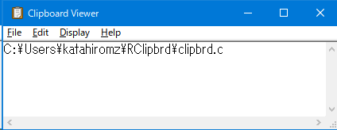

#  Independent ReactOS Clipbrd

This is a clipboard viewer from [ReactOS](https://reactos.org/).



It's a free and open source software for Windows XP and later.

<p align=center>
  <a href="https://reactos.org/">
    
  </a>
</p>

<p align=center>
  <a href="https://reactos.org/donate/">
    
  </a>
  <a href="https://twitter.com/reactos">
    
  </a>
</p>

## Main code contributors

- Copyright 2015-2018 Hermes Belusca-Maito
- Copyright 2015-2018 Ricardo Hanke
- and more!

## Translators

- Copyright 2015, 2016 Erdem Ersoy (eersoy93) (erdemersoy [at] erdemersoy [dot] net),
- Copyright 2016 Henry Tang Ih (henrytang2@hotmail.com)
- Copyright 2016 Henry Tang Ih <henrytang2@hotmail.com>
- Copyright 2018 Ercan Ersoy (ercanersoy) (ercanersoy [at] ercanersoy [dot] net),
- Copyright 2018 George Bișoc (george.bisoc@reactos.org)
- Copyright 2021 Chan Chilung <eason066@gmail.com>
- Copyright 2021 Gabriel Aguiar(fgsoftware1) <fgygh5804@gmail.com,fgsoftwarestudio@gmail.com>
- Copyright 2021 Süleyman Poyraz (zaryob [dot] dev [at] gmail [dot] com)
- Copyright Ismael Ferreras Morezuelas (Swyter)
- Copyright Ștefan Fulea (stefan dot fulea at mail dot com)
- and more!

## How to build?

Please use ReactOS Build Environment (RosBE).

```bash
git clone https://github.com/katahiromz/RClipbrd
cd RClipbrd
cmake -G Ninja -DCMAKE_BUILD_TYPE=Release .
ninja
strip notepad.exe
```

Tested on RosBE, Visual Studio 2015, and Visual Studio 2019.

## License

- GPL 2.0 and later
